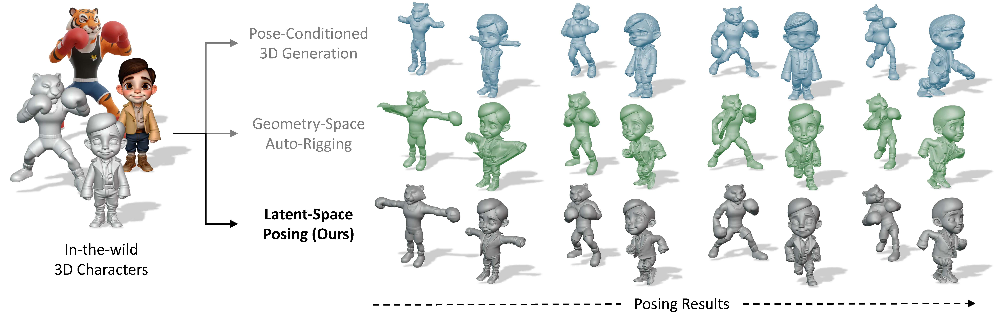

<div align="center">

# Make-It-Poseable: Feed-forward Latent Posing Model for 3D Characters

_**<a href="https://jasongzy.github.io">Zhiyang Guo</a>,
<a href="https://www.ran-zhang.com/">Ori Zhang</a>,
Jax Xiang,
Kai Ma,
Zhenxun Yuan,
Wengang Zhou,
Houqiang Li**_

<a href='https://arxiv.org/abs/2512.16767'></a>
<a href='https://jasongzy.github.io/Make-It-Poseable/'></a>



</div>

## Installation

TBD

## Usage

TBD

## Citation

```bibtex
@article{guo2025make,
    author={Guo, Zhiyang and Zhang, Ran and Xiang, Jinxu and Zhao, Alan and Yuan, Zhenxun and Zhou, Wengang and Li, Houqiang},
    title={Make-It-Poseable: Feed-forward Latent Posing Model for 3D Characters},
    journal={arXiv preprint arXiv:2512.16767},
    year={2025},
}
```
